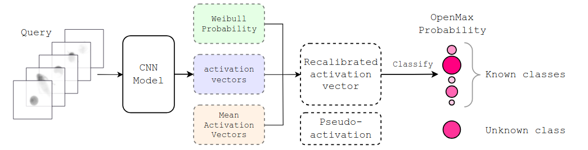
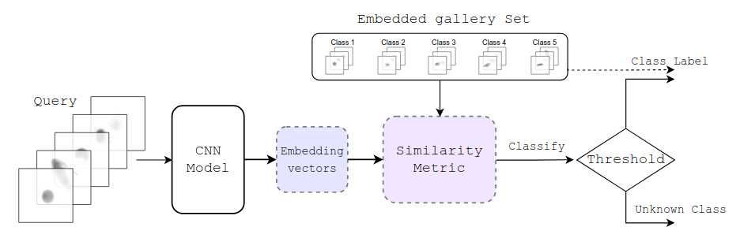
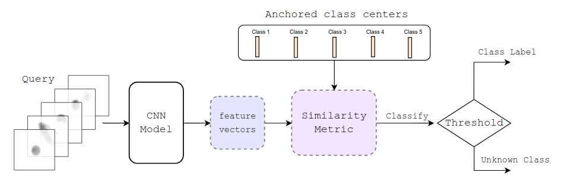

# Open-set Plankton Recognition

Implementation of the open-set recognition methods from the paper "Open-set Plankton Recognition".

## Overview
This repository contains implementations of three open-set recognition methods:
- **OpenMax** 
    - A. Bendale and T. Boult, *"Towards Open Set Deep Networks,"* CVPR 2016
    
    
- **ArcFace** 
    - J. Deng, et al. *"Arcface: Additive Angular Margin Loss for Deep Face Recognition,"* CVPR 2019
    - O. Mohamed, et al. *"Open-Set Plankton Recognition Using Similarity Learning,"* ISVC 2022

    
- **Class Anchored Clustering**
    - D. Miller, et al. *"Class Anchor Clustering: A Loss for Distance-Based Open Set Recognition,"* WACV 2021

    
## Usage

### Datasets
The codes utilize both [SYKE-plankton_IFCB_2022](https://doi.org/10.23728/b2share.abf913e5a6ad47e6baa273ae0ed6617a) and [SYKE-plakton_ZooScan_2024](https://doi.org/10.23729/fa115087-2698-4aa5-aedd-11e260b9694d) datasets. The latter dataset contains splits for both datasets.

1. Download both datasets, and take the folders 'images', and 'class splits' and move those inside the data folder. Move the "labeled_20201020" folder from the SYKE-plankton_IFCB_2022 inside 'images'

2. The `environment.yml` file contains the required conda and pip packages.

3. Run the code in the Jupyter notebook `dataset_creator.ipynb` or alternatively run using ipython:
```python
ipython
%run dataset_creator.ipynb
exit()
```
What the code does:
- The code processes the class splits and augments the training data.
- It saves the preprocessed images into the following folders, as defined in IMG_FOLDER_PATHS:
    - **train**: Contains the augmented and preprocessed training images.
    - **valid**: Contains the preprocessed validation images.
    - **test**: Contains the preprocessed test images.
    
>[!NOTE]
>Some folders might be empty for zooplankton data in train and validation. This is to make sure the split class indices work as intended   

4. The folders contain both training and testing codes for each of the method.
    - The training code saves both best validation accuracy and best loss models and for CAC also best anchor loss. 
    ```Python
    python train_model.py --dataset zooplankton --trial 0 --backbone resnet18 --batch_size 50 --num_workers 4 --name 224_zoo
    ```
    - The testing codes work such that first a best threshold is found for validation set which is then used for test set. 
    ```Python
    python test_model.py --dataset zooplankton --num_trials 1 --start_trial 0 --backbone resnet18 --batch_size 50 --num_workers 4 --name 224_zoo_best_acc
    ```

## Citation
>[!NOTE]
> Update coming when full citation is available

